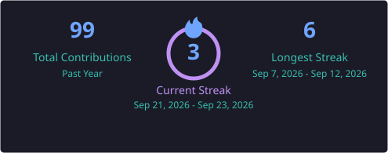

# 👋 Hi, I'm Diyantoro

  

  

---

## 🚀 About Me

I'm an **Informatics student** and **Back-End Developer** passionate about building reliable, scalable, and efficient applications.

- 💻 Focused on **Back-End Development**
- 🧠 Interested in **Artificial Intelligence, Machine Learning & LLM**
- 🔧 Enjoy building APIs, databases, and web applications
- 🎨 Interested in UI/UX and application design
- 🌱 Always learning and improving my development skills
- 🚀 Interested in building useful and scalable digital products

---

## 🛠️ Tech Stack

### 💻 Programming Languages

  

### ⚙️ Frameworks & Libraries

  

### 🗄️ Databases

  

### 🔧 Development Tools

  

### 🎨 Design Tools

  

---

## 📊 GitHub Statistics

  
  

  

---

## 📈 Contribution Activity

  

---

## 🐍 Contribution Snake

  

---

## 📚 Currently Learning

  

I'm continuously improving my knowledge in:

- 🔥 **Laravel & REST API**
- 🐹 **Golang**
- ⚛️ **React & Modern Frontend**
- 🟦 **TypeScript**
- 🗄️ **Database Design & Optimization**
- 🐳 **Docker & Deployment**
- 🤖 **Artificial Intelligence**
- 🧠 **Machine Learning & LLM**
- ✨ **Prompt Engineering**
- 🏗️ **Software Architecture**

---

## 💭 Developer Philosophy

> **"Write code that is simple enough to understand, scalable enough to grow, and reliable enough to trust."**

I believe good software should be:

**Clean • Maintainable • Scalable • Secure • Useful**

---

## 🌐 Connect With Me

  

  &nbsp;

  

  &nbsp;

  

  &nbsp;

  

  <a href="https://github.com/diyantoro">GitHub</a>
  •
  <a href="https://linkedin.com/in/DiyanToro">LinkedIn</a>
  •
  <a href="https://instagram.com/diyyant_">Instagram</a>
  •
  <a href="https://x.com/diyyant_">X</a>

---

  

  <b>Thanks for visiting my profile! 🚀</b>

